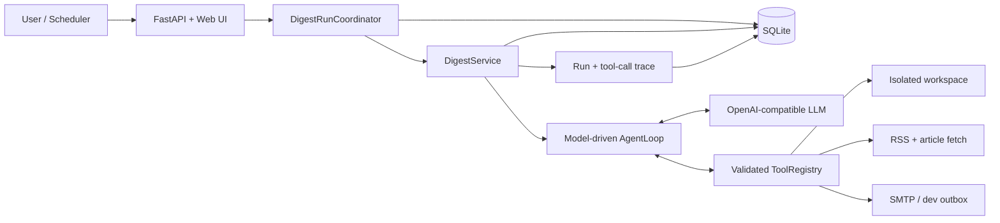

# Architecture decisions

## Product boundary

This repository demonstrates two capabilities at once: a model-controlled Agent Loop
and the engineering required to ship it as a small web product. It is not intended to
be a general-purpose agent framework or a second version of FreeToCode.

## ADR-001: Hand-written function-calling loop

**Decision:** Implement the core loop directly on top of an OpenAI-compatible model
API rather than hiding it behind LangChain or LangGraph.

**Why:** The assignment explicitly evaluates whether the model decides tool order,
repetition, and termination. A small loop is easier to explain, trace, test with a
fake model, and review for failure conditions.

**Required controls:** maximum turns, maximum tool calls, wall-clock timeout, validated
tool arguments, captured errors, and a deterministic fake-model test suite.

## ADR-002: FastAPI with server-rendered pages

**Decision:** Use FastAPI, Jinja2, and small amounts of vanilla JavaScript.

**Why:** A separate SPA would add a second build system without strengthening the
Agent signal. Server-rendered pages are sufficient for subscription editing, manual
runs, history, and trace inspection.

## ADR-003: SQLite for the submission

**Decision:** Use SQLite through SQLAlchemy and Alembic.

**Why:** Option A does not require MySQL. SQLite makes the five-minute setup goal
realistic while migrations and a repository/service boundary preserve a future path
to PostgreSQL or MySQL.

## ADR-004: RSS-first news discovery

**Decision:** Provide an RSS-backed `search_news` tool, with an optional external
search provider added only if time permits.

**Why:** Reviewers must be able to run the project without another paid API. The LLM
still decides search queries, repetition, selection, and article retrieval.

## ADR-005: SMTP with a development outbox

**Decision:** Use SMTP for real delivery and a local outbox when SMTP is disabled.

**Why:** Email clearly satisfies the push requirement, while the outbox keeps local
and CI runs deterministic and credential-free.

## Runtime flow

1. A manual action or scheduler creates an `AgentRun` for a user.
2. The digest service supplies the goal and user identifier to the Agent Loop.
3. The model returns zero or more function calls.
4. The registry validates each call, executes the tool, and records its result.
5. Tool observations are returned to the model for the next turn.
6. A final answer is persisted as a digest and delivered through the chosen tool.
7. Budget exhaustion or an unrecoverable error closes the run with a clear status.

## Implemented Agent runtime

The Day 1 runtime is split across four small boundaries:

- `app.agent.model.ModelClient`: provider-neutral async protocol;
- `OpenAICompatibleModelClient`: translates internal messages and JSON Schema tools;
- `app.tools.registry.ToolRegistry`: validates arguments and normalizes tool outcomes;
- `app.agent.loop.AgentLoop`: owns conversation state, budgets, observations, and trace.

Expected tool failures—including unknown tools, invalid arguments, handler exceptions,
and per-tool timeouts—are returned to the model as structured observations so it can
recover. Invalid model responses and exhausted run budgets instead raise typed errors
that retain the trace and counters accumulated before failure.

## Persistence model

- `users`: identity, email, timezone;
- `subscriptions`: topics, keywords, exclusions, delivery time, enabled state;
- `digests`: content, cited sources, status, delivery timestamp;
- `agent_runs`: model, status, budgets, timing, final error;
- `tool_calls`: turn, name, validated arguments, result preview, latency, success.

All five tables are implemented through SQLAlchemy and created by Alembic migrations.

## Operational limitations

The submission scheduler is designed for one application process. A production
multi-replica deployment would move scheduling and jobs to a dedicated worker and
queue. This trade-off is deliberate and will be documented rather than disguised.

The subscription tool depends on a small provider protocol. Product runs use the
SQLAlchemy provider while isolated tool tests can use the in-memory implementation;
the Agent-facing contract is identical.

## Persistence and run orchestration

Day 3 adds five tables managed by Alembic: `users`, `subscriptions`, `agent_runs`,
`tool_calls`, and `digests`. The API creates a pending run and schedules an in-process
background task. `DigestService` owns state transitions, builds a fresh Agent runtime,
persists a bounded result preview for each tool call, and guarantees a terminal state
for ordinary model, tool, and persistence failures.

A SQLite partial unique index on active statuses prevents two pending/running jobs for
one user even when application-level checks race. This is stronger than relying only
on the UI or a pre-insert query.

The current background runner is intentionally single-process and not durable across
server termination. A production multi-replica system would use a transactional
outbox plus a job queue/worker. That expansion is outside the take-home MVP.

## Web UI and daily scheduling

Day 4 adds thin Jinja entry pages with vanilla JavaScript that consume the same REST
API used by external clients. The dashboard does not keep a second copy of business
logic: user creation, subscription updates, manual runs, history, and trace views all
use `/api` endpoints.

`DailyDigestScheduler` loads enabled subscriptions on startup and creates one
APScheduler `CronTrigger` per user using their IANA timezone. Subscription updates
replace or remove that job immediately. Both manual and scheduled requests pass
through `DigestRunCoordinator`, so validation and the active-run constraint are
consistent regardless of the trigger source.

RSS endpoints are trusted application configuration, not model-controlled URLs.
Article URLs are model-controlled and therefore receive stricter validation. DNS
addresses and every redirect target are checked before requests, although preventing
DNS rebinding completely would require a transport that pins the validated address.

## Reliability boundary

The deterministic test suite replaces only external uncertainty: the model, RSS source,
and SMTP server. It keeps the real Agent Loop, tool validation, filesystem, development
outbox, API, SQLAlchemy repositories, and SQLite constraints. This makes CI repeatable
without turning the end-to-end test into a collection of mocked internal functions.

News preference filtering is intentionally split across two layers. The model chooses
queries and source selection after reading the subscription; `search_news` also applies
include/exclude terms to titles and summaries as a deterministic guardrail. This does
not claim semantic relevance—the model still owns that judgment.

## Deliberate trade-offs and limitations

- **Single-process jobs:** APScheduler and FastAPI background tasks are suitable for the
  take-home, but are not durable across crashes and cannot coordinate multiple replicas.
- **SQLite:** ideal for five-minute local setup, but a production service should use a
  managed relational database with operational backups and stronger concurrency.
- **No authentication:** the UI trusts the caller and must not be exposed publicly as-is.
- **RSS availability:** upstream feeds can fail or rate-limit; partial source failures are
  reported to the model, but there is no durable retry queue.
- **Prompt-level source selection:** keyword filtering is deterministic, while semantic
  relevance, synthesis quality, and factual accuracy still depend on the configured model.
- **Trace previews:** persisted tool results are bounded previews, not a full event log.
- **SSRF boundary:** host resolution and redirects are checked, but complete DNS-rebinding
  protection would require connecting to a pinned validated IP.
- **No durable resume:** interrupted Agent runs end in failure rather than resuming from a
  checkpoint. That is intentionally outside the one-week assignment scope.
